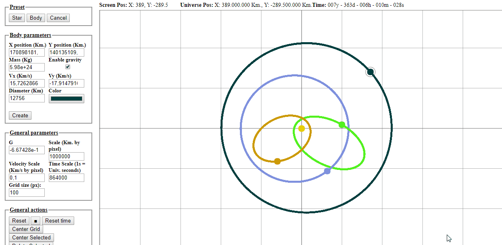

# gravity-lab

Gravity laboratory.

A toy to play with gravity.



## Fetures

* Create objects and set position and velocity using mouse.
* Modify mass, velocity vector (x and y components), position, diameter and color for each body.
* Two presets. Star, with Sun's parameters and Body, with Earth parameters.
* Modify G.
* Set scale, velocity scale, grid and time scale.
* Create bodies providing mass, velocity, position parameters.
* Pre-draw orbits while placing the body
* Trace orbits.
* Infinite universe.
* Change body values in real time.
* Body's gravity enable/disable.

## Pre-requisites to build and run.

* Install npm
* Install gulp
* Browser with HTML5 and ES6 support.

## Build and run

1. Install dependencies.

```
npm install
```

2. Build

```
gulp dist
```
3. Run

Open index.html in your browser, or run

```
gulp watch
```

This last command will open a browser and will load index.html automatically.

## License

Gravity-lab is licensed under the MIT license. (http://opensource.org/licenses/MIT)
